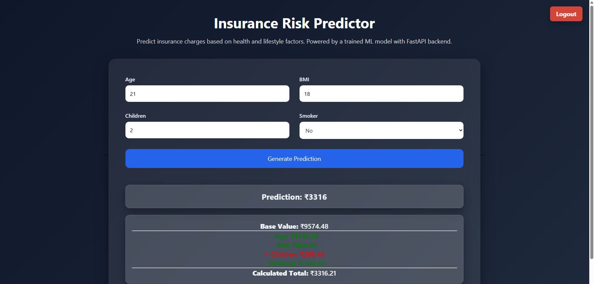
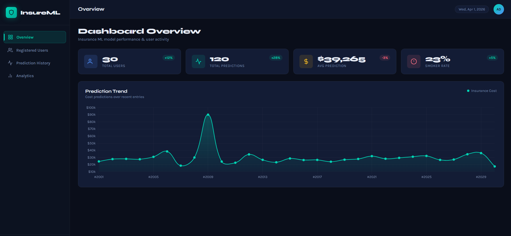
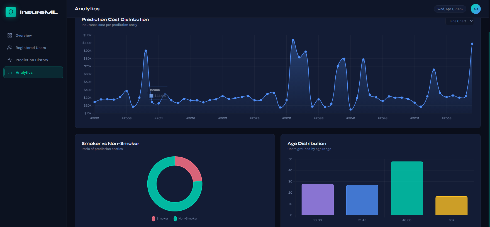
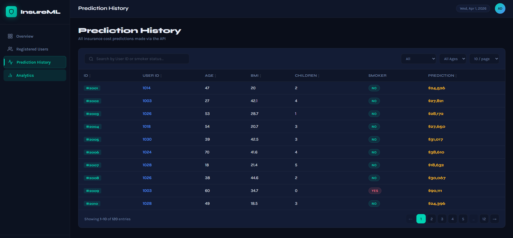

# 🚀 Insurance Risk Prediction System (Full Stack + ML)

A full-stack web application that predicts insurance costs using a machine learning model.  
Users can securely sign up, log in, and get real-time predictions along with explainability of how each feature affects the result.

---

## 🌐 Live Demo

🔗 Frontend: https://ml-insurance-predictor-fastapi.onrender.com  
🔗 Backend API Docs: https://insurance-backend-ewkb.onrender.com/docs  

---

## 🧠 Key Highlights

- ⚡ FastAPI backend with optimized REST APIs (~40–50ms response time)
- 🔐 JWT-based authentication (secure login/signup)
- 📊 SHAP-based model explainability for prediction insights
- 📈 Admin dashboard for tracking user activity and prediction history
- 🧮 ML model with log transformation for improved accuracy on skewed data
- 🐘 PostgreSQL database with scalable schema design
- 🐳 Dockerized backend deployment on Render

---

## ⚙️ Tech Stack

### 🖥️ Frontend
- HTML
- CSS
- JavaScript

### 🔧 Backend
- FastAPI
- SQLAlchemy (ORM)
- Alembic (database migrations)

### 🗄️ Database
- PostgreSQL (Render hosted)

### 🤖 Machine Learning
- Linear Regression (Scikit-learn)
- Log Transformation (for skewed data handling)
- SHAP (Explainability)

### 🚀 Deployment
- Backend: Render (Docker)
- Frontend: Render (Static Site)
- Database: Render PostgreSQL

---

## ✨ Features

- 🔐 User Authentication (Signup/Login with hashed passwords)
- 🎟️ JWT Token-based secure API access
- 📊 Prediction Dashboard for users
- 📈 Graphs:
  - Age distribution
  - Smoker vs Non-smoker percentage
  - Prediction trends
- 🧠 ML Prediction with Explainability (SHAP)
- 🛠️ Admin Panel:
  - View registered users
  - Track prediction history

---

## 🧪 API Endpoints

| Method | Endpoint        | Description                     |
|--------|----------------|---------------------------------|
| POST   | `/register`    | Register new user              |
| POST   | `/login`       | Authenticate user & get token  |
| POST   | `/predict`     | Predict insurance cost         |
| GET    | `/dashboard`   | Admin dashboard data           |

👉 Full API docs available at:  
https://insurance-backend-ewkb.onrender.com/docs

---

## 📂 Project Structure
.
├── frontend/ # UI (HTML, CSS, JS)
├── backend/ # FastAPI backend
├── ml_code/ # ML model logic
├── notebook/ # Model experimentation
├── alembic/ # DB migrations
├── docker-compose.yml
├── alembic.ini
└── README.md

## 📸 Screenshots

## 📸 Screenshots

### 🧠 Prediction Page (Input + Result + Explainability)

### 📊 Dashboard Overview

### 📈 Analytics

### 📋 Prediction History

